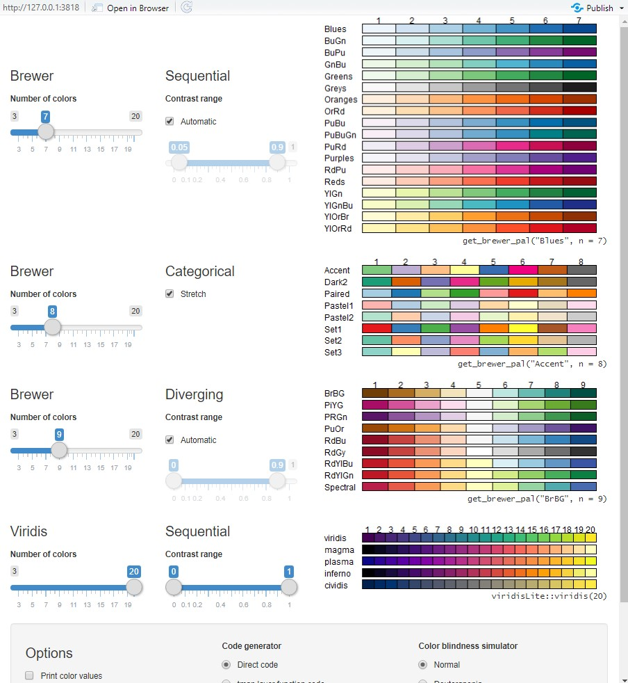

## Objectives
1. Read in vector data in R
2. Create maps: static and interactive 
3. Manipulate spatial data attributes 

## Overview 

Please make sure to install and load the following packages. 
```{r eval=F}
# read spatial data 
library(sf)
# Create maps
library(tmap)
library(tmaptools)
# Basic data manipulation
library(tidyverse)

```

In this lab, we will introduce how to load, visualize and analysis spatial data in R.  For more information about spatial dataset in R, click [*here*](https://geocompr.robinlovelace.net/spatial-class.html#intro-spatial-class). 

```{r echo=F}

xfun::embed_file('data/data_upload.zip')


```


## 1. Vector dataset (simple features)

In GIS field, Vector dataset contains three components: points, lines and polygons. Note: in R, a vector is also a basic data structure which contains element of the same type. Please go back to the content in week 1 if needed. In this lab, we only introduce the concept of vector in GIS field. 

From this [*article*](https://journal.r-project.org/archive/2018/RJ-2018-009/RJ-2018-009.pdf), simple feature is defined as "a standardized way of encoding spatial vector data (points, lines, polygons) in computers". We will use the `sf` package in R to read, write, manipulate, and analyze all common vector datasets in R. 

First, make sure you get the `sf` package installed and loaded. All functions and methods in `sf` package are started with `st_`. Let's use the `st_read()` function to load shaplefiles into R. We also use `class` function to check the data type.  

Here we will check out these datasets:


```{r eval=F}
# Streets in Pitssburgh
street  <-  st_read("data/PghStreets.shp")
# Tracts in Pittsburgh
tract  <-  st_read("data/PghTracts.shp")
# Schools in Pittsburgh
school <- st_read("data/Schools.shp")
# Parcel in Pittsburgh
parcel <- st_read("data/Parcels.shp")
# table for poverty variables at tract level from courtesy of US Census Bureau. 
Poverty <- read_csv("data/PovertyTracts.csv")

class(parcel)
glimpse(parcel)
```

Dataset `parcel` is a simple feature, and it is also a dataframe with 1580 rows and 45 columns. You can also take a look at the dataframe calles parcel under your R environment. The first 44 columns are non-spatial attributes, and the last column is called geometry. The spatial information is saved as a column in the table. Same for other loaded files, where the last column is a single list-column with geometries. 

How vectors are organized in R? 

1) Each row represents a feature (object in the real world) in the space. For example, each row in "school" dataframe represents the location of a school in Pittsburgh. We also call them sf (simple feature). 

2) The geometry column is a simple feature geometry list column. We also call them sfc (simple feature geometry list-column). For example, the last column in school dataframe. 

3) Under the geometry list column, we call each cell as sfg (simple feature geometry), which is the geometry of each individual simple feature.

```{r eval=F}
print(parcel$geometry)
```

If we print the geometry column only, it includes the geometry type, dimensions, bbox (bounding box) projected CRS (projected coordinates), and actual coordinates for each record. In summary, when using sf in R, vector datasets are saved as data frames. It also includes a list-column to store geometric information at the end of the table. 

If you prefer to drop off the geometric information of your dataset, you can try: 

```{r eval=F}
parcel_nosf <- st_drop_geometry(parcel)
```

## 2. Vector dataset attributes

In fact, there are other packages such as `sp` to read and write spatial data in R. However, `sf` package is more popular these days due to its fast reading and writing data speed. Simple features are also widely supported by other packages e.g. `ggplot` and `tmap` packages to create maps.  The census dataset via `tidycensus` package also supports simple feature format. All the functions in `sf` package are relatively consistent and intuitive. In addition, most of the time you can use simple feature objects as basic data frames, which means most of the functions and operations we introduced before will work here. `sf` functions and datasets can be combined with pipes and other functions from `tidyverse` package. 

For example, we can use `filter` and `select` functions in the `tidyverse` package to subset our dataset. The command below subset schools where the enrollment is less than 100 students. You can also subset certain columns using `select` function.  The output is still a simple feature data frame. Note the spatial component: geometry list column will be preserved into the output. 

```{r eval=F}
school_subset_rows <- school %>% filter(ENROLL<100)
school_subset_cols <- school %>% select(ENROLL) 
```

Alternatively, to extract a column with non-spatial component, you can use `$`. 
```{r eval=F}
school$ENROLL
```

You can also use `group_by` and `summarise` to aggregate dataset by a certain categorical variable. The command below calculates the average enrollment for each type of schools. The spatial component is still included in the output. 

```{r eval=F}
school_type <- school %>% group_by(TYPE) %>% summarise(enrollment=mean(ENROLL, na.rm=T))

```


When working with spatial data, it is very common to have datasets from different sources. We can join extra tables, or datasets with spatial data objects in R too. The functions we introduced before will also work here for spatial data: `lef_join()`, `right_join()`, `semi_join()` etc. 


Let's combine the poverty dataset with the tract simple feature dataset. To connect these two data, the keys are GEOID. GEOID are codes that uniquely identify all administrative/legal and statistical geographic areas for which the Census Bureau tabulates data.  Please visit
[here](https://www.census.gov/programs-surveys/geography/guidance/geo-identifiers.html) for more information about GEOID. 

Note the column name are different: in tract it is called GEOID10, and in poverty dataset it is called "GEOIid2". We will use left_join function to append the attributes from povery to tract    dataset. 

```{r eval=F}
tract_pov <- tract %>% left_join(Poverty, by=c("GEOID10"="GEOid2") )
```

You will get an error message. The data type for these columns are not identical, so we cannot perform join function. So it is very important to check out data types especially categorical variables before any further analysis. In poverty dataset, the GEOID column is in numeric data type; In tract, it is treated as characters. 

```{r eval=F}
class(Poverty$GEOid2)
class(tract$GEOID10)
```


Since GEOID are unique identification codes for different geographic areas, in other words, no mathmatical operations or calculations are allowed for these values. We need to make sure the GEOID column is saved as characters instead of numeric field in R. Then we can move to the join process. The output is a spatial data set which also include the poverty attribute for each tract. 
```{r eval=F}
Poverty$GEOid2 <- as.character(Poverty$GEOid2)
tract_pov <- tract %>% left_join(Poverty, by=c("GEOID10"="GEOid2") )
```


## 3. Visualizing vector data in R

We have already introduced how to create figures in R before. You can create figures e.g. line charts, histogram, or bar chart based on attributes for a spatial object. For example, we can simply plot out the histogram for enrollment in school dataset. 

```{r eval=F}
library(tidyverse)
ggplot(school)+geom_histogram(aes(x=ENROLL), bins=10)
```

One of the important output and product for spatial data is map. Making maps is an art, or we call them cartography, to visualize spatial distributions and relationships. Maps make it possible for us to perceive patterns and processes that are often difficult to express verbally. 

In this section, we will talk about how to create static and interactive maps in R. 

Based on the usage of maps, there are two big categories of maps 

1) Reference map: emphasises on the location of spatial object. 

 

2) Themetic map: shows a particular attribute associated with a certain area. Usually we use different colors, sizes of symbols to represent different values. In this exercise, we primarily focuses on creating thematic maps in R. 


### 3.1 Static maps

First, make sure you have these datasets ready in  your R environment: school as points, streets as lines, and tract, parcel as polygons.

To start, we can simply use the generic `plot` function to create static maps for spatial dataset in R. Note by default plot function will generate a single map for each attribute. You can also specify the attribute you are interested in within the plot function. Here let's try to plot out sale price for each parcel. 

```{r eval=F}
plot(parcel)
plot(parcel["SALEPRICE"])
```

Alternatively, you can use geom_sf function in the ggplot package to create maps for simple feature. Since parcel is a polygon dataset, we can fill the color of each polygon by the level of price.

Tip: We can use `label_number_si` function to automatically scales and labels with the best SI prefix, for example, "K" for values ≥ 10e3, "M" for ≥ 10e6, "B" for ≥ 10e9, and "T" for ≥ 10e12.

```{r eval=F}
ggplot()+geom_sf(data=parcel, aes(fill=SALEPRICE))+scale_fill_continuous(label = scales::label_number_si())
```

To create thematic maps based on shapefiles, `tmap` package is highly recommended due to its flexibility. Make sure you have the packages `tmap` and `tmaptools` installed and loaded in R. 

The basic `tmap` syntax is very similar to what we introduced before using ggplot. We first need to initiate a map object using `tm_shape()`, and we can further add additional objects to our map using additional arguments. Each components are connected using `+`. Below is the summary of commonly used function in `tmap` package. 

Name  | Description
------------- | -------------
tm_dots  | Draw symbols or dots to visulize point features
tm_bubbles|Draw bubbles to display points 
tm_lines|Draw spatial lines
tm_polygons|Draw polygons, it is a combination of both tm_fill and tm_borders
tm_fill|Fills the polygons
tm_borders|Just draws polygon borders
tm_basemap|Add base map tiles
tm_compass| Add compass or north arrow on your map
tm_scale_bar|Add scale bar
tm_credits| Add map credits as text on your map
tm_grid|Add coordiante system as grids on your map
tm_text| Add text labels for each feature
tm_layout| Change the layout of your map
tm_mode|Allow you to switch between “view” and “plot” modes. View indicate interactive maps and plot are static maps

First, let's visulize schools as points using tmap package. 

1) initiate a map object using tm_shape, and the dataset is school
2) use bubbles to display location of schools. The size of the bubble represent number of enrollment per school. 

```{r eval=F}
tm_shape(school)+tm_bubbles(size="ENROLL")
```


Alternatively, you can just use dots to represent the location for each school in Pittsburgh. You can even create multiple plots by a certain column using tm_facets. Below we plot out schools by different type: High school, elementary, etc. 

```{r eval=F}
tm_shape(school)+tm_dots(size="ENROLL")
tm_shape(school)+tm_dots(size="ENROLL")+tm_facets(by="TYPE")
```

The map only shows location for each school. If you are not familar with Pittsburgh area, it is hard for you to understand this map. In addition, more elements e.g. title, scale bar, and base map are needed. Let's further improve the map:


1) Let's first add a base map from open street map. Make sure you have `tmaptools` package installed and loaded. In order to load the base map only within the extent of schools in Pittsburgh, we need to extract the extent (bounding box) of schools using `st_bbox` function to further limit the extent for the base map. `read_osm` function will load open street map data within the defined extent only. 

2) The schools are displayed as bubbles in red on top of the base map. 

```{r eval=F}
library(tmaptools)
# extract extent of schools
Pitts_bb <- st_bbox(school)
# Read in open street base map within the extent defined above
Pitt_base <- read_osm(Pitts_bb)
# First create map for the base map. Then add schools as red bubbles.
tm_shape(Pitt_base)+
tm_rgb()+
tm_shape(school)+
tm_bubbles(size="ENROLL", col="red", title.size = "Enrollment per school")+
  # To adjust the legend position. 
  # The first value specifies horizontal and the second value vertical justification. 
  tm_layout(legend.outside=TRUE, legend.outside.position=c("bottom","left"))
```

Let's try to add street (type as avenue only) as lines to our map. So first we need to subset street data under TYPE avenue only. The geometry list column should also be returned for the subset.  

```{r eval=F}
ave <- street %>% filter(TYPE=="AVE")
```

Since all the map elements are connected using `+`, and each item is added on top of the existing map layout, we usually plot out spatial objects in the "bottom-up" order to improve the map’s aesthetic appeal: 

1) base map, 2) polygons; 3) polylines; 4) points; 5) other map elements e.g. title.

```{r eval=F}
tm_shape(Pitt_base)+
tm_rgb()+
  tm_shape(ave)+ # set line width as 1 for streets
  tm_lines(lwd=1)+
tm_shape(school)+
tm_bubbles(size="ENROLL", col="red", title.size = "Enrollment per school")+
  tm_layout(legend.outside=TRUE, legend.outside.position=c("bottom","left"))
```

Next, let's create maps for polygons using `tm_polygons. For each polygon, we can use different color to represent numeric variables or categorical variables. 

The example below generates a thematic map at tract level, where the color represent value for population below poverty level. 

```{r eval=F}
tm_shape(tract_pov) +
  # Set up variable to be displayed and title for the legend. 
 tm_polygons(col="PopBelowPovLevel", title="Population")+
  # add a north arrow on top right. 
 tm_compass(position = c("right", "top"))+
 tm_scale_bar(position = c("left", "bottom"))+
  # title for the map
 tm_layout(main.title = "Population below poverty")
```

You can also set up different classification method for your map using the `style=""` argument within tm_polygons. The classificaiton method is also very important since how we group our dataset into small groups is one of the most fundamental aspects of the map visulization. Otherwise, our map could be misleading. So it is recommended to check out if the variable we are interested in is normally distributed or not, then decide a proper classification method. 

The commonly used options are:

1) Equal interval map

`style = "equal"`

- Breaks data range into equal intervals
- Prefers equally distributed data
- Easier to detect outliers
- Usually used to display percentages or temperature values

2) Quantile map

`style = "quantile"`

- Same number of features in each bin
- Outliers are not as obvious
- Prefers ordinal data e.g. 

3) Natural breaks (Jenks)

`style = "jenks"`

- Algorithms that attempts to find “natural breaks” in the data
- Shows clear distinctions between classes
- Good for not normally distributed data

4) Categorical variables

`style = "cat"`

- Represent categorical values. 
- Assign a unique color to each category.

```{r eval=F}
# Quantile map
tm_shape(tract_pov) +
  tm_polygons("PopBelowPovLevel", 
              style="quantile", 
              title="Population")+
  tm_compass(position = c("right", "top"))+
 tm_scale_bar(position = c("left", "bottom"))+
  # title for the map
 tm_layout(main.title = "Population below poverty in quantile")

# Natural breaks with 3 classes. 
tm_shape(tract_pov) +
  tm_polygons("PopBelowPovLevel", 
              style="jenks", n=3,
              title="Population")+
  tm_compass(position = c("right", "top"))+
 tm_scale_bar(position = c("left", "bottom"))+
  # title for the map
 tm_layout(main.title = "Population below poverty in natural breaks")

# Equal interval map
tm_shape(tract_pov) +
  tm_polygons("PopBelowPovLevel", 
              style="equal", n=4,
              title="Population")+
  tm_compass(position = c("right", "top"))+
 tm_scale_bar(position = c("left", "bottom"))+
  # title for the map
 tm_layout(main.title = "Population below poverty in equal interval")
```


To better map our dataset spatially, we also have 3 different color palettes: categorical, sequential and diverging. 

1) Categorical palette consists of easily distinguishable colors for a certain categorical group and are most no apparent or particular order for the colors. 

2) Sequential consists of a gradient of color, usually from light to dark colors. Light colors tend to represent lower values, and dark color usually represents higher values. Sequential palette usually is the best option for numeric variables

3) Diverging palette is a two-way color scheme, where darker colors represents extremes at both ends, and lighter colors represent midrange. It is ideal to show values where you have positive change or negative change (dark color), and where no changes are identified (light color). 


Please check out the screenshot below to explore more about color palette. You can also execute out the script below to load the instruction in your R window. Note you should have package `shiny` and 'shinyjs' installed and loaded. 

```{r eval=F}
library(shinyjs)
palette_explorer()
```




To choose a different color for our map above, we set palette="PuRd" within the tm_polygon function. 

```{r eval=F}
tm_shape(tract_pov) +
  tm_polygons("PopBelowPovLevel", 
              style="jenks", n=3,
              palette = "PuRd",
              title="Population")+
  tm_compass(position = c("right", "top"))+
 tm_scale_bar(position = c("left", "bottom"))+
  # title for the map
 tm_layout(main.title = "Population below poverty in natural breaks")
```


### 3.2 Interactive maps

One unique feature of `tmap` package is to create interactive maps. Sometimes you would prefer users to zoom in and click on your map for more information. `tmap` allows us to view maps interactively by switching to the view mode. By default (tmap_mode("plot")), the maps are in static mode, or we call them `plot` mode in tmap package. But we can turn on the interactive map mode by calling:

```{r eval=F}
tmap_mode("view")
```


After this point, all the maps produced by `tmap` package will be interactive, where allows you to zoom in and zoom out. Let's try to plot out Population below povety as an interactive map. On your bottom right, an interactive map will pop up, and you can zoom in, or click on any feature to load details. You can also change the base map here:


```{r eval=F}
tm_shape(tract_pov) +
  tm_polygons("PopBelowPovLevel", 
              style="jenks", n=3,
              palette = "PuRd",
              title="Population")

```


We can also create faceted plots using tm_facets function. We can generate multiple maps side by side with synchronized zoom and pan settings. For example, we generate two interactive maps to plot both Population with poverty status and popolation below poverty levels, to see if there are any spatial patterns. 

```{r eval=F}
tm_shape(tract_pov) + tm_polygons(c("PopWithPovStatus","PopBelowPovLevel")) + 
  tm_facets(nrow = 1, sync = TRUE)
```

## 4. Export spatial data
`sf` package also allows you to save the spatial data to your local disk. For example, we can export this tract polygon with poverty information locally as a shapefile. We can continue to use this shapefile to other platforms as well, e.g. ArcGIS products. 
```{r eval=F}
st_write(tract_pov, "data/tract_pov.shp")
```


